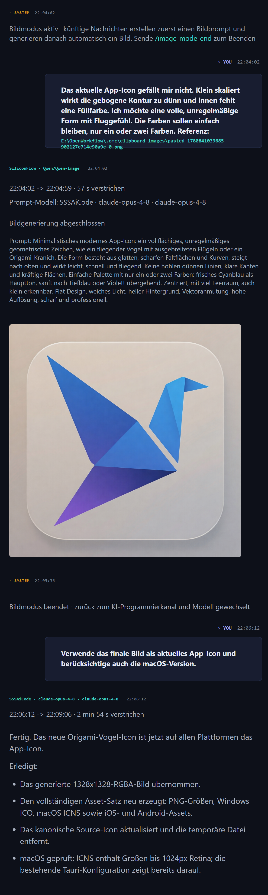

# FreeUltraCode

<div align="center">
  <a href="../../README.md">English</a> | <a href="README.zh-CN.md">中文</a> | <a href="README.fr.md">Français</a> | Deutsch | <a href="README.es.md">Español</a> | <a href="README.pt-BR.md">Português</a> | <a href="README.ru.md">Русский</a> | <a href="README.ja.md">日本語</a> | <a href="README.ko.md">한국어</a> | <a href="README.hi.md">हिन्दी</a> | <a href="README.ar.md">العربية</a>
</div>

Nicht jede Programmieraufgabe sollte teures Premium-Kontingent verbrauchen. FreeUltraCode bringt Claude Code, Codex, Gemini, kostenlose Kanäle und lokale Modelle in eine lokale Chat-Oberfläche. Nutze günstige Modelle für Recherche und Routinearbeit, und stärkere Modelle für wichtige Entscheidungen.

<p align="center">
  <strong>Routing kostenloser Kanäle</strong><br>
  
</p>

## Warum FreeUltraCode

Coding Agents sind nützlich, aber Premium-Kontingente sind schnell aufgebraucht. FreeUltraCode hält die Chat-Erfahrung lokal und macht es einfach, Anfragen über kostenlose, Test- oder Niedrigkostenkanäle zu routen, wenn diese ausreichen.

- Nutze GitHub Models, Hugging Face Router, SambaNova Cloud, Together AI, Gemini, DeepSeek, Kimi, Groq, OpenRouter, NVIDIA NIM, Z.ai, Kilo, LLM7, Ollama, LM Studio und llama.cpp.
- API-Keys und Provider-Einstellungen bleiben auf deinem Rechner.
- Runtime, Kanal, Berechtigungsmodus und Workspace lassen sich direkt im Chat Composer wechseln.
- Chat-Verlauf, Favoriten, geplante Prompts und Workspace-Kontext bleiben lokal.
- Lokale Modelle funktionieren ohne API-Key, wenn deine Hardware sie unterstützt.

## Funktionen

### Programmier-Chat

- Frage nach Codeänderungen, Bug-Analyse, Refactoring, Tests, Release Notes oder Dokumentation.
- Füge Dateipfade hinzu oder ziehe Dateien in den Composer.
- Sieh gestreamte Antworten, Befehlslogs, Dateireferenzen und Zusammenfassungen in einer Chat-Oberfläche.
- Stelle Folgefragen in derselben Sitzung.

### Bildgenerierung + Programmieren

- Nutze ein Bildgenerierungsmodell und ein Programmiermodell in derselben lokalen Unterhaltung.
- Wechsle in den Bildmodus, wenn du visuelle Assets, Icons, Poster oder Designreferenzen brauchst, und danach zurück zum Programmiermodell, um sie im Projekt zu verwenden.
- Generierte Bilder, Prompts, Provider-Daten, Logs und spätere Codeänderungen bleiben im selben Sitzungsverlauf.

### Routing kostenloser Modelle

- **20+ Remote-Kanäle plus lokale Runtimes**: NVIDIA NIM, OpenRouter, GitHub Models, Hugging Face Router, SambaNova Cloud, Together AI, Google Gemini, DeepSeek, Mistral, Mistral Codestral, OpenCode, Wafer, Kimi, Cerebras, Groq, Fireworks, Z.ai, LLM7, Kilo Gateway, plus Ollama, LM Studio und llama.cpp.
- **Experimentelle Routen ohne Key**: LLM7 und Kilo Gateway können ohne API-Key getestet werden, sollten aber nur für nicht sensible Coding-Prompts genutzt werden.
- **Offizielle Gratis- oder Testkontingente**: Provider-Keys werden lokal in der App gespeichert.
- Der lokale Rust-Proxy übersetzt zwischen Anthropic- und OpenAI-kompatiblen Protokollen.
- Claude Code kann über konfigurierte kostenlose Kanäle laufen, ohne die Chat-Oberfläche zu ändern.
- Keys, Modell-Overrides und lokale Modelle werden in den Einstellungen verwaltet.

Aktuelle programmierorientierte Standardmodelle:

| Kanal | Standardmodell |
| --- | --- |
| GitHub Models | `openai/gpt-4.1-mini` |
| Hugging Face Router | `deepseek-ai/DeepSeek-V4-Pro` |
| SambaNova Cloud | `DeepSeek-V3.1` |
| Together AI | `Qwen/Qwen3-Coder-480B-A35B-Instruct-FP8` |
| Kilo Gateway | `poolside/laguna-xs.2:free` |
| LLM7 | `codestral-latest` |

### Dynamischer Workflow (/ultracode)

Für komplexe mehrstufige Programmieraufgaben generiert `/ultracode <Aufgabe>` spontan ein maßgeschneidertes Ausführungs-Harness und führt es sofort aus. Kein visuelles Canvas nötig.

- Beschreibe die Aufgabe in natürlicher Sprache — der Planer baut ein Harness mit parallelen Subagenten, adversarieller Verifikation und Akzeptanzgattern.
- Sechs interne Strategien werden automatisch gewählt: Klassifizieren & Handeln, Fächer & Synthese, Adversarielle Verifikation, Generieren & Filtern, Turnier, Schleife bis zur Fertigstellung.
- Jeder Lauf wird vollständig unter `.fuc-run/<run-id>/` protokolliert: Aufgabenbuch, Ereignisse, Urteil und Endergebnis.
- Ausführung über die Desktop-App oder CLI: `fuc ultracode "<Aufgabe>" --json --interactive --cwd <workspace>`.
- Null Konfiguration — verwendet die lokalen `claude` CLI-Anmeldeinformationen.

#### Free Auto — Automatische Mehrkanal-Umschaltung

Der **Auto**-Kanal (`freecc:auto` im Channel-Menü) leitet jede Anfrage automatisch an den besten verfügbaren kostenlosen Kanal weiter — ohne manuelles Umschalten.

- Rotiert durch alle konfigurierten kostenlosen Kanäle und überspringt automatisch Kanäle mit Ratenbegrenzung (429) oder Upstream-Fehlern (5xx).
- Verfolgt kanalspezifische Abkühlzeiten mit Backoff: nach einem Fehler pausiert ein Kanal für eine gewisse Zeit.
- Unterstützt optionale Modell-Überschreibung, sodass alle automatisch gerouteten Anfragen dasselbe Modell nutzen.
- Wenn alle Kanäle erschöpft sind, wird ein 503 mit Fehlerprotokoll zurückgegeben.

#### Multi-Provider-Kette: DeepSeek → CodeX

Mit `/ultracode` kann das Harness mehrere Provider über die Planschritte hinweg automatisch verketten. Typisches Muster: DeepSeek erzeugt kostengünstige Entwürfe, CodeX übernimmt die Verfeinerung zur finalen Qualität.

- Der **dynamische Harness-Plan** unterstützt `model`-Überschreibungen pro Schritt — DeepSeek für Brainstorming/Klassifikation, CodeX/Gemini für Implementierung/Verifikation.
- **cc-switch-Kompatibilität**: FreeUltraCode liest die `cc-switch` CLI-Konfiguration; jeder für Claude Code konfigurierte Provider ist sofort für Ultracode-Schritte verfügbar.
- Die **Fächer-und-Synthese**-Strategie parallelisiert DeepSeek-Worker über unabhängige Teilaufgaben, ein Konsens-Gate (CodeX) synthetisiert und verifiziert die Ergebnisse.

#### Geschwindigkeitsbewusste Kanalauswahl

Der Auto-Kanal des Free-Proxy priorisiert Kanäle basierend auf Echtzeit-Verfügbarkeitssignalen:

- **Ratenbegrenzungs-Bewusstsein**: Kanäle mit 429 werden für 30+ Sekunden abgekühlt, um vergebliche Versuche zu vermeiden.
- **Schnelles Fehlschlagen bei Fehlern**: Nicht-wiederholbare Fehler (4xx Auth, 5xx Upstream) werden mit Cooldowns verfolgt; der Auto-Router überspringt sie.
- **Verbindungszeit-Budget**: Jeder Kanalversuch unterliegt dem Upstream-Timeout; der Auto-Router blockiert nicht an einem einzigen langsamen Upstream.
- **Natürliche Reaktivitäts-Reihenfolge**: Erfolgreiche Kanäle werden zuerst versucht; fehlerhafte Kanäle ans Ende der Liste verschoben.

Diese Funktionen sorgen für resiliente `/ultracode`-Harness-Läufe, selbst wenn einzelne kostenlose Provider langsam, ratenbegrenzt oder vorübergehend nicht verfügbar sind.

## Schnellstart

```bash
cd app
npm install
npm run dev
```

Desktop-App starten:

```bash
cd app
npm run desktop
```

Produktionspaket bauen:

```bash
cd app
npm run package
```

## Nutzung

### Kostenlosen Kanal registrieren

1. Öffne unten das Menü **Channel** und wähle einen kostenlosen Kanal mit Warnsymbol, zum Beispiel **Free · OpenRouter**.

<p align="center">
  
</p>

2. Klicke im API-Key-Dialog auf **Open registration site**.

<p align="center">
  
</p>

3. Erstelle auf der Provider-Seite einen neuen API-Key und kopiere ihn.

<p align="center">
  
</p>

4. Füge den Key in FreeUltraCode ein und klicke auf **Save and Use**. Nach dem Speichern verschwindet das Warnsymbol.

<p align="center">
  
</p>

5. Alle Kanäle kannst du auch unter **Settings** -> **Channels** -> **Free Channels** verwalten.

<p align="center">
  
</p>

Sobald der Kanal bereit ist, kannst du über die untere Eingabe über diese Route chatten.

### Bildmodus nutzen

Der Bildmodus macht den Chat Composer zur Texteingabe für Bildgenerierung, ohne den Sitzungsverlauf zu verlassen. Das ist praktisch für UI-Assets, Icons, Poster und Designreferenzen, bevor du wieder zum Programmieren wechselst.

1. Öffne **Settings** -> **Images**, wähle den Standard-Bildprovider und trage API-Key, Account ID, Base URL oder lokalen ComfyUI-Endpunkt ein.
2. Schreibe in einer Chat-Sitzung `/image-mode-start`. Du kannst den ersten Prompt direkt anhängen:

```text
/image-mode-start ein sauberes App-Icon für einen lokalen Coding-Agenten, Glaseffekt, 1024x1024
```

3. Solange der Modus aktiv ist, erzeugen normale Nachrichten Bilder statt Codeänderungen. Der **Channel**-Selector zeigt dann Bildprovider.
4. Beschreibe das gewünschte Bild. FreeUltraCode lässt zuerst das Programmiermodell den Bildprompt verbessern und sendet ihn danach an den konfigurierten Provider.

<p align="center">
  
</p>

5. Sende `/image-mode-end`, um zum Programmierkanal und Modell zurückzukehren. Für ein einzelnes Bild ohne dauerhaften Modus nutze `/image`, `/img`, `/draw`, `/生图` oder `/画图` plus Prompt.

## Funktionsweise

```text
Nutzeranfrage
    |
    v
Chat Composer
    |
    +--> gewählte Runtime / Kanal / Berechtigungen / Workspace
             |
             +--> Provider-API, lokale CLI oder lokaler Free-Channel-Proxy
                        |
                        +--> gestreamte Ausgabe, Tool-Log und Chat-Verlauf
```

## Technologie

| Bereich | Technologie |
| --- | --- |
| Desktop-Shell | Tauri 2, Rust |
| Frontend | React 18, Vite 5, TypeScript 5 |
| State | Zustand |
| Styling | Tailwind CSS, CSS-Variablen |
| Icons | lucide-react |
| Provider-Routing | Claude Code, Codex, Gemini, erweiterbare Provider-Einstellungen |
| Free-Channel-Proxy | Rust `tiny_http` + `ureq`, Anthropic/OpenAI-Übersetzung |

## Projektstruktur

```text
app/
  src/
    components/  Gemeinsame UI-Komponenten
    lib/         Provider-Einstellungen, Free-Channel-Routing, Persistenz
    panels/      Sidebar, Chat-Dock, Einstellungen, Planung
    store/       Zustand-State und lokaler Verlauf
  src-tauri/
    src/
      free_proxy.rs    Rust Reverse Proxy + Anthropic/OpenAI-Übersetzung
      lib.rs           Tauri-Kommandos, Datei-/Verlaufsbrücke
  doc/                 Tutorials, lokalisierte READMEs, Screenshots
```

## Dokumentation

- [Chinesischer Guide zur Registrierung kostenloser Kanäle](register-free-channel.md)
- [Englische README](../../README.md)

## Entwicklung

```bash
npm run dev
npm run typecheck
npm run lint
npm run test
npm run desktop
npm run package
```

## Community

- Discord: <https://discord.gg/2C9ptSEFG>
- QQ Group: `149523963`
- Issues: <https://github.com/wellingfeng/FreeUltraCode/issues>

## Lizenz

Es wurde noch keine Lizenz angegeben.
