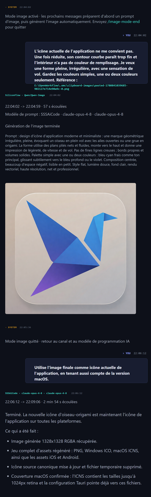

# FreeUltraCode

<div align="center">
  <a href="../../README.md">English</a> | <a href="README.zh-CN.md">中文</a> | Français | <a href="README.de.md">Deutsch</a> | <a href="README.es.md">Español</a> | <a href="README.pt-BR.md">Português</a> | <a href="README.ru.md">Русский</a> | <a href="README.ja.md">日本語</a> | <a href="README.ko.md">한국어</a> | <a href="README.hi.md">हिन्दी</a> | <a href="README.ar.md">العربية</a>
</div>

Tous les travaux de programmation ne méritent pas de consommer votre quota premium. FreeUltraCode rassemble Claude Code, Codex, Gemini, les canaux gratuits et les modèles locaux dans une interface de chat locale. Utilisez les modèles bon marché pour explorer, puis les modèles plus fiables pour les décisions importantes.

<p align="center">
  <strong>Routage des canaux gratuits</strong><br>
  
</p>

## Pourquoi FreeUltraCode

Les agents de programmation sont utiles, mais les quotas des modèles premium partent vite. FreeUltraCode garde l'expérience de chat locale et facilite le routage des requêtes vers des canaux gratuits, d'essai ou moins chers quand ils suffisent.

- Utilisez GitHub Models, Hugging Face Router, SambaNova Cloud, Together AI, Gemini, DeepSeek, Kimi, Groq, OpenRouter, NVIDIA NIM, Z.ai, Kilo, LLM7, Ollama, LM Studio et llama.cpp.
- Gardez les clés API et les paramètres fournisseur sur votre machine.
- Changez de runtime, canal, mode d'autorisation et workspace depuis la zone de saisie.
- Conservez localement l'historique, les favoris, les prompts planifiés et le contexte du workspace.
- Utilisez des modèles locaux sans clé API si votre machine les supporte.

## Fonctions principales

### Chat de programmation

- Demandez des modifications de code, une enquête de bug, un refactor, des tests, des notes de version ou de la documentation.
- Ajoutez des chemins de fichiers ou glissez des fichiers dans la zone de saisie.
- Suivez les réponses streamées, les journaux de commandes, les références de fichiers et les résumés dans la même conversation.
- Continuez avec des demandes de suivi dans la même session.

### Génération d'images + programmation

- Utilisez un modèle de génération d'images et un modèle de programmation dans la même conversation locale.
- Passez en mode image pour créer des assets visuels, icônes, affiches ou références de design, puis revenez au modèle de programmation pour les intégrer au projet.
- L'image générée, le prompt, les détails du fournisseur, les logs et les changements de code suivants restent dans le même historique.

### Routage des modèles gratuits

- **20+ canaux distants et runtimes locaux** : NVIDIA NIM, OpenRouter, GitHub Models, Hugging Face Router, SambaNova Cloud, Together AI, Google Gemini, DeepSeek, Mistral, Mistral Codestral, OpenCode, Wafer, Kimi, Cerebras, Groq, Fireworks, Z.ai, LLM7, Kilo Gateway, plus Ollama, LM Studio et llama.cpp.
- **Routes expérimentales sans clé** : LLM7 et Kilo Gateway peuvent être essayés sans clé API, mais seulement pour des prompts de code non sensibles.
- **Routes avec quota gratuit ou d'essai** : les clés fournisseur restent stockées localement dans l'application.
- Le proxy Rust local traduit entre les protocoles Anthropic et OpenAI-compatible.
- Claude Code peut passer par les canaux gratuits configurés sans changer l'interface de chat.
- Les clés, les modèles personnalisés et les modèles locaux se gèrent depuis les paramètres.

Modèles par défaut orientés programmation :

| Canal | Modèle par défaut |
| --- | --- |
| GitHub Models | `openai/gpt-4.1-mini` |
| Hugging Face Router | `deepseek-ai/DeepSeek-V4-Pro` |
| SambaNova Cloud | `DeepSeek-V3.1` |
| Together AI | `Qwen/Qwen3-Coder-480B-A35B-Instruct-FP8` |
| Kilo Gateway | `poolside/laguna-xs.2:free` |
| LLM7 | `codestral-latest` |

### Workflow dynamique (/ultracode)

Pour les tâches de programmation complexes en plusieurs étapes, `/ultracode <tâche>` génère à la volée un harness d'exécution sur mesure et l'exécute immédiatement. Aucun canevas visuel n'est nécessaire.

- Décrivez la tâche en langage naturel — le planificateur construit un harness avec des sous-agents parallèles, une vérification adversariale et des portes d'acceptation.
- Six stratégies internes sont choisies automatiquement : classification-action, éventail-synthèse, vérification adversariale, génération-filtrage, tournoi, boucle jusqu'à complétion.
- Chaque exécution est entièrement journalisée sous `.fuc-run/<run-id>/` avec registre de tâches, événements, verdict et résultat final.
- Lancement depuis l'application desktop ou en CLI : `fuc ultracode "<tâche>" --json --interactive --cwd <workspace>`.
- Zéro configuration — réutilise les identifiants de connexion locaux de la CLI `claude`.

#### Free Auto — Basculement automatique multi-canal

Le canal **Auto** (`freecc:auto` dans le menu Channel) achemine automatiquement chaque requête vers le meilleur canal gratuit disponible, sans intervention manuelle.

- Alterne entre tous les canaux gratuits configurés, en sautant automatiquement ceux qui atteignent les limites de débit (429) ou retournent des erreurs upstream (5xx).
- Suivi des refroidissements par canal avec backoff : quand un canal retourne une erreur, il est mis en pause avant d'être réessayé.
- Prend en charge un remplacement de modèle optionnel pour que toutes les requêtes auto-routées utilisent le même modèle.
- Si tous les canaux sont épuisés, retourne un 503 avec le journal des échecs pour diagnostiquer la panne.

#### Chaîne multi-fournisseur : DeepSeek → CodeX

Avec `/ultracode`, le harness peut enchaîner automatiquement plusieurs fournisseurs à travers les étapes du plan. Un schéma typique : laisser DeepSeek produire des ébauches rapides à faible coût, puis laisser CodeX reprendre et raffiner le résultat.

- Le **plan de harness dynamique** prend en charge les remplacements de `model` par étape — attribuez DeepSeek aux étapes de brainstorming/classification et CodeX/Gemini aux étapes d'implémentation/vérification.
- **Compatibilité cc-switch** : FreeUltraCode lit la configuration CLI `cc-switch`, tout fournisseur déjà configuré pour le routage Claude Code est immédiatement disponible pour les étapes ultracode.
- La stratégie **éventail-synthèse** parallélise les workers DeepSeek sur des sous-tâches indépendantes, puis une porte de consensus (CodeX) synthétise et vérifie les résultats.

#### Sélection de canal sensible à la vitesse

Le canal Auto du proxy gratuit priorise les canaux selon des signaux de disponibilité en temps réel :

- **Conscience des limites de débit** : les canaux retournant 429 sont refroidis pendant 30+ secondes avant réessai, évitant les tentatives inutiles sur des upstreams saturés.
- **Échec rapide sur erreurs** : les erreurs non-réessayables (échecs d'authentification 4xx, pannes upstream 5xx) sont suivies par canal avec refroidissement ; le routeur Auto les saute.
- **Budget de temps de connexion** : chaque tentative de canal est soumise au timeout upstream ; le routeur Auto parcourt les candidats sans bloquer sur un seul upstream lent.
- **Ordre naturel par réactivité** : les canaux qui réussissent restent sans refroidissement et sont essayés en premier ; les canaux en erreur sont repoussés en fin de liste.

Ces fonctionnalités assurent la résilience des exécutions de harness `/ultracode`, même lorsque certains fournisseurs gratuits sont lents, limités en débit ou temporairement indisponibles.

## Démarrage rapide

```bash
cd app
npm install
npm run dev
```

Pour l'application desktop :

```bash
cd app
npm run desktop
```

Pour créer un package de production :

```bash
cd app
npm run package
```

## Utilisation

### Enregistrer un canal gratuit

1. Ouvrez le menu **Channel** en bas et choisissez un canal gratuit avec un symbole d'avertissement, par exemple **Free · OpenRouter**.

<p align="center">
  
</p>

2. Dans la boîte de dialogue de clé API, cliquez sur **Open registration site**.

<p align="center">
  
</p>

3. Créez une nouvelle clé API sur la page du fournisseur, puis copiez-la.

<p align="center">
  
</p>

4. Collez la clé dans FreeUltraCode et cliquez sur **Save and Use**. Après l'enregistrement, le symbole d'avertissement disparaît.

<p align="center">
  
</p>

5. Vous pouvez aussi gérer tous les canaux depuis **Settings** -> **Channels** -> **Free Channels**.

<p align="center">
  
</p>

Quand le canal est prêt, utilisez la zone de saisie du bas pour discuter via cette route.

### Utiliser le mode image

Le mode image transforme la zone de chat en entrée texte-vers-image tout en gardant le même historique de session. Il sert à créer des assets d'interface, icônes, affiches et références de design avant de revenir au code.

1. Ouvrez **Settings** -> **Images**, choisissez le fournisseur d'images par défaut, puis renseignez l'API key, l'Account ID, la Base URL ou l'endpoint ComfyUI local requis.
2. Dans une session de chat, tapez `/image-mode-start`. Vous pouvez aussi lancer le mode et générer une première image dans le même message :

```text
/image-mode-start une icône d'application nette pour un agent de code local, effet verre, 1024x1024
```

3. Tant que le mode est actif, les messages ordinaires génèrent des images au lieu de lancer des modifications de code. Le sélecteur **Channel** passe aux fournisseurs d'images.
4. Décrivez l'image voulue. FreeUltraCode fait d'abord améliorer le prompt par le modèle de programmation, puis l'envoie au fournisseur configuré.

<p align="center">
  
</p>

5. Envoyez `/image-mode-end` pour revenir au canal et au modèle de programmation. Pour générer une seule image sans mode persistant, utilisez `/image`, `/img`, `/draw`, `/生图` ou `/画图` suivi du prompt.

## Fonctionnement

```text
Demande utilisateur
    |
    v
Zone de chat
    |
    +--> runtime / canal / autorisations / workspace sélectionnés
             |
             +--> API fournisseur, CLI local ou proxy local de canal gratuit
                        |
                        +--> sortie streamée, journal d'outils et historique
```

## Stack technique

| Domaine | Technologie |
| --- | --- |
| Shell desktop | Tauri 2, Rust |
| Frontend | React 18, Vite 5, TypeScript 5 |
| État | Zustand |
| Style | Tailwind CSS, variables CSS |
| Icônes | lucide-react |
| Routage fournisseur | Claude Code, Codex, Gemini, provider settings extensibles |
| Proxy canaux gratuits | Rust `tiny_http` + `ureq`, traduction Anthropic/OpenAI |

## Structure du projet

```text
app/
  src/
    components/  Composants UI partagés
    lib/         Paramètres fournisseur, routage des canaux gratuits, persistance
    panels/      Sidebar, chat dock, paramètres, planification
    store/       État Zustand et historique local
  src-tauri/
    src/
      free_proxy.rs    Proxy inverse Rust + traduction Anthropic/OpenAI
      lib.rs           Commandes Tauri, pont fichiers/historique
  doc/                 Tutoriels, README localisés, captures
```

## Documentation

- [Guide chinois d'inscription à un canal gratuit](register-free-channel.md)
- [README anglais](../../README.md)

## Développement

```bash
npm run dev
npm run typecheck
npm run lint
npm run test
npm run desktop
npm run package
```

## Communauté

- Discord: <https://discord.gg/2C9ptSEFG>
- QQ Group: `149523963`
- Issues: <https://github.com/wellingfeng/FreeUltraCode/issues>

## Licence

Aucune licence n'a encore été spécifiée.
