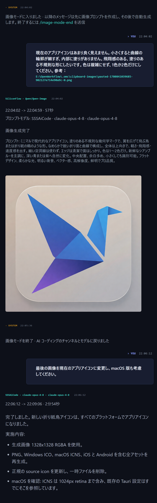

# FreeUltraCode

<div align="center">
  <a href="../../README.md">English</a> | <a href="README.zh-CN.md">中文</a> | <a href="README.fr.md">Français</a> | <a href="README.de.md">Deutsch</a> | <a href="README.es.md">Español</a> | <a href="README.pt-BR.md">Português</a> | <a href="README.ru.md">Русский</a> | 日本語 | <a href="README.ko.md">한국어</a> | <a href="README.hi.md">हिन्दी</a> | <a href="README.ar.md">العربية</a>
</div>

すべてのプログラミング作業に高価なモデルの枠を使う必要はありません。FreeUltraCode は Claude Code、Codex、Gemini、無料チャネル、ローカルモデルを 1 つのローカルチャット画面にまとめます。探索や下書きは安いモデルで行い、重要な判断は安定したモデルに任せられます。

<p align="center">
  <strong>無料チャネルルーティング</strong><br>
  
</p>

## なぜ FreeUltraCode か

Coding agent は便利ですが、プレミアムモデルの枠はすぐに減ります。FreeUltraCode はローカルのチャット体験を保ちつつ、十分な場合は無料枠、試用枠、低コストチャネルへ簡単にルーティングできるようにします。

- GitHub Models、Hugging Face Router、SambaNova Cloud、Together AI、Gemini、DeepSeek、Kimi、Groq、OpenRouter、NVIDIA NIM、Z.ai、Kilo、LLM7、Ollama、LM Studio、llama.cpp を利用できます。
- API キーと provider 設定は自分のマシンに保存されます。
- runtime、channel、permission mode、workspace をチャット入力欄から切り替えられます。
- 履歴、 favorites、scheduled prompts、workspace context をローカルに保持します。
- ハードウェアが対応していれば、ローカルモデルは API キーなしで使えます。

## できること

### プログラミング用 Chat

- コード修正、バグ調査、リファクタ、テスト、リリースノート、ドキュメント作成を依頼できます。
- ファイルパスを指定したり、ファイルを入力欄へドラッグできます。
- ストリーミング出力、コマンドログ、ファイル参照、要約を 1 つのチャット画面で確認できます。
- 同じセッションで続けて相談できます。

### 画像生成 + プログラミング

- 同じローカル会話の中で、画像生成モデルとプログラミングモデルを使えます。
- ビジュアル素材、アイコン、ポスター、デザイン参照が必要なときに画像モードへ入り、生成後はプログラミングモデルに戻ってプロジェクトへ反映できます。
- 生成画像、プロンプト、プロバイダー情報、ログ、その後のコード変更は同じ履歴に残ります。

### 無料モデルルーティング

- **20+ のリモートチャネルとローカル runtime**: NVIDIA NIM、OpenRouter、GitHub Models、Hugging Face Router、SambaNova Cloud、Together AI、Google Gemini、DeepSeek、Mistral、Mistral Codestral、OpenCode、Wafer、Kimi、Cerebras、Groq、Fireworks、Z.ai、LLM7、Kilo Gateway、Ollama、LM Studio、llama.cpp。
- **キー不要の実験的ルート**: LLM7 と Kilo Gateway は API キーなしで試せますが、機密ではない coding prompt に限定するのが安全です。
- **公式の無料枠または試用枠**: provider key はアプリ内にローカル保存されます。
- ローカル Rust proxy が Anthropic と OpenAI-compatible プロトコルを変換します。
- Claude Code はチャット UI を変えずに、設定済みの無料チャネル経由で利用できます。
- キー、モデル上書き、ローカルモデル設定は settings で管理できます。

現在のプログラミング向けデフォルトモデル:

| チャネル | デフォルトモデル |
| --- | --- |
| GitHub Models | `openai/gpt-4.1-mini` |
| Hugging Face Router | `deepseek-ai/DeepSeek-V4-Pro` |
| SambaNova Cloud | `DeepSeek-V3.1` |
| Together AI | `Qwen/Qwen3-Coder-480B-A35B-Instruct-FP8` |
| Kilo Gateway | `poolside/laguna-xs.2:free` |
| LLM7 | `codestral-latest` |

### 動的ワークフロー (/ultracode)

複雑な多段階のプログラミングタスクでは、`/ultracode <タスク>` がその場で専用の実行ハーネスを生成し、即座に実行します。ビジュアルキャンバスは不要です。

- 自然言語でタスクを記述すると、プランナーが並列サブエージェント、敵対的検証、受け入れゲートを備えたハーネスを構築します。
- 6 つの内部戦略が自動選択されます：分類実行、ファンアウト合成、敵対的検証、生成フィルタ、トーナメント、完了までのループ。
- すべての実行は `.fuc-run/<run-id>/` 以下に完全記録され、タスク台帳、イベント、判定、最終結果が保存されます。
- デスクトップアプリまたは CLI から実行：`fuc ultracode "<タスク>" --json --interactive --cwd <workspace>`。
- 設定不要 — ローカルの `claude` CLI ログイン情報を再利用します。

#### Free Auto — マルチチャンネル自動切替

**Auto** チャンネル（Channel メニューの `freecc:auto`）は、各リクエストを現在利用可能な最適な無料チャンネルに自動ルーティングします。手動切替不要。

- 設定済みの全無料チャンネルを巡回し、レート制限（429）やアップストリームエラー（5xx）が発生したチャンネルを自動スキップ。
- チャンネルごとのクールダウンをバックオフ付きで追跡：エラー後、一時停止してから再試行。
- オプションのモデル上書きをサポートし、どのチャンネルが処理しても全リクエストが同一モデルを使用。
- 全チャンネルが枯渇した場合、障害ログ付きの503を返し、停止原因を診断可能。

#### マルチプロバイダーチェーン：DeepSeek → CodeX

`/ultracode` 使用時、ハーネスは計画ステップ間で複数プロバイダーを自動的に連結できます。典型的なパターン：DeepSeek が低コストで応答草案を生成し、CodeX が引き継いで最終品質に仕上げます。

- **動的ハーネス計画**はステップごとの `model` 上書きをサポート — ブレインストーミング/分類ステップに DeepSeek、実装/検証ステップに CodeX/Gemini を割当て。
- **cc-switch 互換性**：FreeUltraCode は `cc-switch` CLI 設定を読み取り、Claude Code ルーティング用に設定済みの全プロバイダーが即座に ultracode ステップで利用可能。
- **ファンアウト合成**戦略は DeepSeek ワーカーを独立サブタスクに並列化し、コンセンサスゲート（CodeX）が結果を合成・検証。

#### 速度を考慮したチャンネル選択

無料プロキシの Auto チャンネルは、リアルタイムの可用性シグナルに基づいてチャンネルを優先します：

- **レート制限認識**：429 を返すチャンネルは30秒以上クールダウンし、飽和したアップストリームへの無駄な試行を防止。
- **エラー時の高速失敗**：再試行不可能なエラー（4xx 認証失敗、5xx アップストリーム障害）はチャンネルごとにクールダウン追跡。Auto ルーターがスキップ。
- **接続時間予算**：各チャンネル試行はアップストリームのタイムアウトに従う。Auto ルーターは単一の低速アップストリームでブロックしない。
- **応答性による自然順序**：成功したチャンネルはクールダウン記録がなく自然に優先。エラーチャンネルは候補リスト末尾に後回し。

これらの機能により、個別の無料プロバイダーが低速、レート制限中、または一時的に利用不可でも `/ultracode` ハーネス実行は高い回復力を維持します。

## クイックスタート

```bash
cd app
npm install
npm run dev
```

デスクトップアプリを起動:

```bash
cd app
npm run desktop
```

本番パッケージを作成:

```bash
cd app
npm run package
```

## 基本的な使い方

### 無料チャネルを登録する

1. 下部の **Channel** メニューを開き、警告マーク付きの無料チャネルを選びます。例: **Free · OpenRouter**。

<p align="center">
  
</p>

2. API key ダイアログで **Open registration site** をクリックします。

<p align="center">
  
</p>

3. provider のページで新しい API key を作成し、コピーします。

<p align="center">
  
</p>

4. FreeUltraCode に key を貼り付け、**Save and Use** をクリックします。保存後、警告マークが消えます。

<p align="center">
  
</p>

5. **Settings** -> **Channels** -> **Free Channels** から全チャネルをまとめて管理できます。

<p align="center">
  
</p>

チャネルが ready になったら、下部の入力欄からそのルートでチャットできます。

### 画像モードを使う

画像モードは、同じセッション履歴を保ったまま Chat composer を text-to-image 入力に切り替えます。UI 素材、アイコン、ポスター、デザイン参照を作ってからコード作業へ戻るときに使います。

1. **Settings** -> **Images** を開き、既定の画像プロバイダーを選び、API key、Account ID、Base URL、またはローカル ComfyUI endpoint を設定します。
2. チャットセッションで `/image-mode-start` と入力します。最初の prompt を同時に付けることもできます。

```text
/image-mode-start ローカル coding agent 向けのクリーンなアプリアイコン、ガラス効果、1024x1024
```

3. モード中は、通常のメッセージがコード編集ではなく画像生成になります。**Channel** セレクターは画像プロバイダーに切り替わります。
4. 作りたい画像を説明します。FreeUltraCode はまずプログラミングモデルで画像 prompt を整え、その後設定済みプロバイダーへ送信します。

<p align="center">
  
</p>

5. `/image-mode-end` を送ると、プログラミング用の channel と model に戻ります。常駐モードにせず 1 枚だけ生成する場合は、`/image`、`/img`、`/draw`、`/生图`、`/画图` の後に prompt を続けます。

## 仕組み

```text
ユーザーの依頼
    |
    v
Chat composer
    |
    +--> selected runtime / channel / permission / workspace
             |
             +--> provider API, local CLI, or local free-channel proxy
                        |
                        +--> streamed output, tool log, and chat history
```

## 技術スタック

| 領域 | 技術 |
| --- | --- |
| Desktop shell | Tauri 2, Rust |
| Frontend | React 18, Vite 5, TypeScript 5 |
| State | Zustand |
| Styling | Tailwind CSS, CSS variables |
| Icons | lucide-react |
| Provider routing | Claude Code, Codex, Gemini, extensible provider settings |
| Free-channel proxy | Rust `tiny_http` + `ureq`, Anthropic/OpenAI protocol translation |

## プロジェクト構成

```text
app/
  src/
    components/  共通 UI コンポーネント
    lib/         provider 設定、無料チャネル routing、永続化
    panels/      Sidebar、chat dock、settings、scheduling UI
    store/       Zustand state とローカル履歴
  src-tauri/
    src/
      free_proxy.rs    Rust reverse proxy + Anthropic/OpenAI translation
      lib.rs           Tauri commands, filesystem/history bridge
  doc/                 チュートリアル、ローカライズ README、スクリーンショット
```

## ドキュメント

- [無料チャネル登録ガイド 中国語](register-free-channel.md)
- [English README](../../README.md)

## 開発

```bash
npm run dev
npm run typecheck
npm run lint
npm run test
npm run desktop
npm run package
```

## コミュニティ

- Discord: <https://discord.gg/2C9ptSEFG>
- QQ Group: `149523963`
- Issues: <https://github.com/wellingfeng/FreeUltraCode/issues>

## ライセンス

ライセンスはまだ指定されていません。
