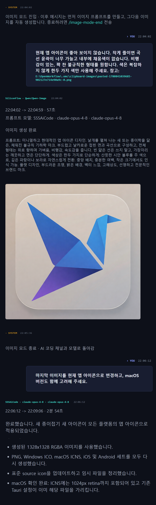

# FreeUltraCode

<div align="center">
  <a href="../../README.md">English</a> | <a href="README.zh-CN.md">中文</a> | <a href="README.fr.md">Français</a> | <a href="README.de.md">Deutsch</a> | <a href="README.es.md">Español</a> | <a href="README.pt-BR.md">Português</a> | <a href="README.ru.md">Русский</a> | <a href="README.ja.md">日本語</a> | 한국어 | <a href="README.hi.md">हिन्दी</a> | <a href="README.ar.md">العربية</a>
</div>

모든 프로그래밍 작업에 가장 비싼 모델 할당량을 쓸 필요는 없습니다. FreeUltraCode는 Claude Code, Codex, Gemini, 무료 채널, 로컬 모델을 하나의 로컬 채팅 화면에 모읍니다. 탐색과 반복 작업은 저렴한 모델로 처리하고, 중요한 판단은 더 안정적인 모델에 맡길 수 있습니다.

<p align="center">
  <strong>무료 채널 라우팅</strong><br>
  
</p>

## FreeUltraCode가 필요한 이유

코딩 에이전트는 유용하지만 프리미엄 모델 할당량은 빠르게 줄어듭니다. FreeUltraCode는 채팅 경험을 로컬에 두고, 충분한 경우 무료, 체험 크레딧, 저비용 채널로 요청을 쉽게 보낼 수 있게 합니다.

- GitHub Models, Hugging Face Router, SambaNova Cloud, Together AI, Gemini, DeepSeek, Kimi, Groq, OpenRouter, NVIDIA NIM, Z.ai, Kilo, LLM7, Ollama, LM Studio, llama.cpp를 사용할 수 있습니다.
- API 키와 provider 설정은 사용자 컴퓨터에 저장됩니다.
- runtime, channel, permission mode, workspace를 채팅 입력 영역에서 바로 바꿀 수 있습니다.
- 채팅 기록, 즐겨찾기, 예약 prompt, workspace context를 로컬에 보관합니다.
- 하드웨어가 지원하면 로컬 모델은 API 키 없이 사용할 수 있습니다.

## 주요 기능

### 프로그래밍 Chat

- 코드 수정, 버그 조사, 리팩터링, 테스트, 릴리스 노트, 문서 작성을 요청할 수 있습니다.
- 파일 경로를 붙이거나 파일을 입력창에 드래그할 수 있습니다.
- 스트리밍 응답, 명령 로그, 파일 참조, 요약을 한 채팅 화면에서 확인할 수 있습니다.
- 같은 세션에서 후속 요청을 이어갈 수 있습니다.

### 이미지 생성 + 프로그래밍

- 같은 로컬 대화 안에서 이미지 생성 모델과 프로그래밍 모델을 함께 사용할 수 있습니다.
- 시각 자료, 아이콘, 포스터, 디자인 레퍼런스가 필요할 때 이미지 모드로 전환하고, 생성 후 다시 프로그래밍 모델로 돌아와 프로젝트에 적용할 수 있습니다.
- 생성 이미지, 프롬프트, Provider 정보, 로그, 이후 코드 변경이 같은 세션 기록에 남습니다.

### 무료 모델 라우팅

- **20+ 원격 채널과 로컬 runtime**: NVIDIA NIM, OpenRouter, GitHub Models, Hugging Face Router, SambaNova Cloud, Together AI, Google Gemini, DeepSeek, Mistral, Mistral Codestral, OpenCode, Wafer, Kimi, Cerebras, Groq, Fireworks, Z.ai, LLM7, Kilo Gateway, 그리고 Ollama, LM Studio, llama.cpp.
- **키 없는 실험 채널**: LLM7과 Kilo Gateway는 API 키 없이 테스트할 수 있지만, 민감하지 않은 코딩 prompt에만 쓰는 것이 좋습니다.
- **공식 무료 또는 체험 크레딧 채널**: provider key는 앱에 로컬로 저장됩니다.
- 로컬 Rust proxy가 Anthropic과 OpenAI-compatible 프로토콜을 변환합니다.
- Claude Code는 채팅 UI를 바꾸지 않고 설정된 무료 채널을 통해 사용할 수 있습니다.
- 키, 모델 override, 로컬 모델 설정은 settings에서 관리합니다.

현재 기본 프로그래밍 모델:

| 채널 | 기본 모델 |
| --- | --- |
| GitHub Models | `openai/gpt-4.1-mini` |
| Hugging Face Router | `deepseek-ai/DeepSeek-V4-Pro` |
| SambaNova Cloud | `DeepSeek-V3.1` |
| Together AI | `Qwen/Qwen3-Coder-480B-A35B-Instruct-FP8` |
| Kilo Gateway | `poolside/laguna-xs.2:free` |
| LLM7 | `codestral-latest` |

### 동적 워크플로우 (/ultracode)

복잡한 다단계 프로그래밍 작업의 경우, `/ultracode <작업>` 이 즉시 전용 실행 하네스를 생성하고 바로 실행합니다. 비주얼 캔버스가 필요하지 않습니다.

- 자연어로 작업을 설명하면 플래너가 병렬 하위 에이전트, 적대적 검증, 수락 게이트를 갖춘 하네스를 구축합니다.
- 6가지 내부 전략이 자동으로 선택됩니다: 분류 후 실행, 팬아웃 합성, 적대적 검증, 생성 후 필터링, 토너먼트, 완료까지 반복.
- 모든 실행은 `.fuc-run/<run-id>/` 아래에 전체 기록되며 작업 원장, 이벤트, 판정 및 최종 결과가 저장됩니다.
- 데스크톱 앱 또는 CLI에서 실행: `fuc ultracode "<작업>" --json --interactive --cwd <workspace>`.
- 설정 불필요 — 로컬 `claude` CLI 로그인 자격 증명을 재사용합니다.

#### Free Auto — 멀티채널 자동 전환

**Auto** 채널(Channel 메뉴의 `freecc:auto`)은 각 요청을 현재 사용 가능한 최적의 무료 채널로 자동 라우팅합니다. 수동 전환 불필요.

- 구성된 모든 무료 채널을 순환하며, 속도 제한(429) 또는 업스트림 오류(5xx)가 발생한 채널을 자동 건너뜁니다.
- 채널별 쿨다운을 백오프와 함께 추적: 오류 발생 후 일시 정지 후 재시도.
- 선택적 모델 재정의를 지원하여 모든 자동 라우팅 요청이 동일한 모델을 사용.
- 모든 채널이 소진되면 장애 로그와 함께 503을 반환하여 중단 원인 진단 가능.

#### 멀티 프로바이더 체인: DeepSeek → CodeX

`/ultracode` 사용 시, 하네스는 계획 단계 간에 여러 프로바이더를 자동으로 연결할 수 있습니다. 일반적인 패턴: DeepSeek이 저비용으로 초안을 생성하고, CodeX가 이어받아 최종 품질로 다듬습니다.

- **동적 하네스 계획**은 단계별 `model` 재정의를 지원 — 브레인스토밍/분류 단계에 DeepSeek, 구현/검증 단계에 CodeX/Gemini 할당.
- **cc-switch 호환성**: FreeUltraCode는 `cc-switch` CLI 구성을 읽어 Claude Code 라우팅용으로 구성된 모든 프로바이더를 ultracode 단계에서 즉시 사용 가능.
- **팬아웃 합성** 전략은 DeepSeek 워커를 독립적인 하위 작업으로 병렬화하고, 합의 게이트(CodeX)가 결과를 합성 및 검증.

#### 속도 인식 채널 선택

무료 프록시의 Auto 채널은 실시간 가용성 신호를 기반으로 채널을 우선순위화합니다:

- **속도 제한 인식**: 429를 반환하는 채널은 30초 이상 쿨다운되어 포화된 업스트림에 대한 낭비 시도를 방지.
- **오류 시 빠른 실패**: 재시도 불가능한 오류(4xx 인증 실패, 5xx 업스트림 중단)는 채널별 쿨다운으로 추적. Auto 라우터가 건너뜀.
- **연결 시간 예산**: 각 채널 시도는 업스트림 타임아웃 적용. Auto 라우터가 단일 느린 업스트림에서 차단되지 않음.
- **응답성 기반 자연 순서**: 성공한 채널이 먼저 시도되고, 오류 채널은 후보 목록 끝으로 밀림.

이 기능들은 개별 무료 프로바이더가 느리거나, 속도 제한 중이거나, 일시적으로 사용 불가능한 경우에도 `/ultracode` 하네스 실행의 복원력을 보장합니다.

## 빠른 시작

```bash
cd app
npm install
npm run dev
```

데스크톱 앱 실행:

```bash
cd app
npm run desktop
```

프로덕션 패키지 빌드:

```bash
cd app
npm run package
```

## 기본 사용법

### 무료 채널 등록

1. 하단 **Channel** 메뉴를 열고 경고 표시가 있는 무료 채널을 선택합니다. 예: **Free · OpenRouter**.

<p align="center">
  
</p>

2. API key 대화상자에서 **Open registration site**를 클릭합니다.

<p align="center">
  
</p>

3. provider 페이지에서 새 API key를 만들고 복사합니다.

<p align="center">
  
</p>

4. FreeUltraCode에 key를 붙여넣고 **Save and Use**를 클릭합니다. 저장 후 경고 표시가 사라집니다.

<p align="center">
  
</p>

5. **Settings** -> **Channels** -> **Free Channels**에서도 모든 무료 채널을 관리할 수 있습니다.

<p align="center">
  
</p>

채널이 준비되면 하단 입력창에서 해당 경로로 대화할 수 있습니다.

### 이미지 모드 사용

이미지 모드는 같은 세션 기록을 유지한 채 채팅 입력창을 텍스트-이미지 생성 입력으로 바꿉니다. UI 에셋, 아이콘, 포스터, 디자인 레퍼런스를 만든 뒤 다시 코드 작업으로 돌아갈 때 유용합니다.

1. **Settings** -> **Images**를 열고 기본 이미지 Provider를 선택한 뒤 필요한 API key, Account ID, Base URL 또는 로컬 ComfyUI endpoint를 입력합니다.
2. 채팅 세션에서 `/image-mode-start`를 입력합니다. 첫 프롬프트를 같은 메시지에 붙일 수도 있습니다.

```text
/image-mode-start 로컬 코딩 에이전트용 깔끔한 앱 아이콘, 유리 효과, 1024x1024
```

3. 모드가 켜져 있는 동안 일반 메시지는 코드 편집 대신 이미지를 생성합니다. **Channel** 선택기는 이미지 Provider로 전환됩니다.
4. 원하는 이미지를 설명합니다. FreeUltraCode는 먼저 프로그래밍 모델로 이미지 프롬프트를 다듬고, 설정된 Provider로 보냅니다.

<p align="center">
  
</p>

5. `/image-mode-end`를 보내면 프로그래밍 channel과 model로 돌아갑니다. 지속 모드 없이 한 장만 만들려면 `/image`, `/img`, `/draw`, `/生图`, `/画图` 뒤에 프롬프트를 입력합니다.

## 동작 방식

```text
사용자 요청
    |
    v
Chat composer
    |
    +--> selected runtime / channel / permission / workspace
             |
             +--> provider API, local CLI, or local free-channel proxy
                        |
                        +--> streamed output, tool log, and chat history
```

## 기술 스택

| 영역 | 기술 |
| --- | --- |
| Desktop shell | Tauri 2, Rust |
| Frontend | React 18, Vite 5, TypeScript 5 |
| State | Zustand |
| Styling | Tailwind CSS, CSS variables |
| Icons | lucide-react |
| Provider routing | Claude Code, Codex, Gemini, extensible provider settings |
| Free-channel proxy | Rust `tiny_http` + `ureq`, Anthropic/OpenAI protocol translation |

## 프로젝트 구조

```text
app/
  src/
    components/  공용 UI 컴포넌트
    lib/         provider 설정, 무료 채널 라우팅, persistence
    panels/      Sidebar, chat dock, settings, scheduling UI
    store/       Zustand state와 로컬 기록
  src-tauri/
    src/
      free_proxy.rs    Rust reverse proxy + Anthropic/OpenAI translation
      lib.rs           Tauri commands, filesystem/history bridge
  doc/                 튜토리얼, 현지화 README, 스크린샷
```

## 문서

- [무료 채널 등록 가이드 중국어](register-free-channel.md)
- [English README](../../README.md)

## 개발

```bash
npm run dev
npm run typecheck
npm run lint
npm run test
npm run desktop
npm run package
```

## 커뮤니티

- Discord: <https://discord.gg/2C9ptSEFG>
- QQ Group: `149523963`
- Issues: <https://github.com/wellingfeng/FreeUltraCode/issues>

## 라이선스

아직 라이선스가 지정되지 않았습니다.
