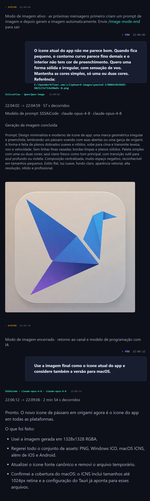

# FreeUltraCode

<div align="center">
  <a href="../../README.md">English</a> | <a href="README.zh-CN.md">中文</a> | <a href="README.fr.md">Français</a> | <a href="README.de.md">Deutsch</a> | <a href="README.es.md">Español</a> | Português | <a href="README.ru.md">Русский</a> | <a href="README.ja.md">日本語</a> | <a href="README.ko.md">한국어</a> | <a href="README.hi.md">हिन्दी</a> | <a href="README.ar.md">العربية</a>
</div>

Nem toda tarefa de programação merece gastar cota dos modelos mais caros. O FreeUltraCode reúne Claude Code, Codex, Gemini, canais gratuitos e modelos locais em uma interface de chat local. Use modelos baratos para explorar e reserve modelos mais estáveis para decisões importantes.

<p align="center">
  <strong>Roteamento de canais gratuitos</strong><br>
  
</p>

## Por que FreeUltraCode

Agentes de programação são úteis, mas a cota de modelos premium acaba rápido. O FreeUltraCode mantém a experiência de chat local e facilita enviar solicitações para canais gratuitos, de teste ou de baixo custo quando eles são suficientes.

- Use GitHub Models, Hugging Face Router, SambaNova Cloud, Together AI, Gemini, DeepSeek, Kimi, Groq, OpenRouter, NVIDIA NIM, Z.ai, Kilo, LLM7, Ollama, LM Studio e llama.cpp.
- Mantenha API keys e configurações de provedores na sua máquina.
- Troque runtime, canal, modo de permissão e workspace direto no compositor de chat.
- Preserve localmente histórico, favoritos, prompts agendados e contexto do workspace.
- Use modelos locais sem API key quando o hardware permitir.

## O que ele faz

### Chat de programação

- Peça alterações de código, investigação de bugs, refatoração, testes, notas de release ou documentação.
- Anexe caminhos de arquivos ou arraste arquivos para o compositor.
- Veja saída em streaming, logs de comandos, referências de arquivos e resumos em uma única superfície de chat.
- Continue com solicitações de acompanhamento na mesma sessão.

### Geração de imagens + programação

- Use um modelo de geração de imagens e um modelo de programação na mesma conversa local.
- Entre no modo de imagem quando precisar de assets visuais, ícones, pôsteres ou referências de design; depois volte ao modelo de programação para aplicar os assets no projeto.
- A imagem gerada, o prompt, os dados do provedor, os logs e as alterações de código seguintes ficam no mesmo histórico.

### Roteamento de modelos gratuitos

- **20+ canais remotos e runtimes locais**: NVIDIA NIM, OpenRouter, GitHub Models, Hugging Face Router, SambaNova Cloud, Together AI, Google Gemini, DeepSeek, Mistral, Mistral Codestral, OpenCode, Wafer, Kimi, Cerebras, Groq, Fireworks, Z.ai, LLM7, Kilo Gateway, além de Ollama, LM Studio e llama.cpp.
- **Rotas experimentais sem key**: LLM7 e Kilo Gateway podem ser testados sem API key, mas use apenas para prompts de código não sensíveis.
- **Rotas oficiais com cota grátis ou de teste**: as chaves dos provedores ficam salvas localmente no app.
- O proxy local em Rust traduz entre protocolos Anthropic e OpenAI-compatible.
- Claude Code pode passar por canais gratuitos configurados sem mudar a interface de chat.
- Keys, modelos personalizados e modelos locais são gerenciados nas configurações.

Modelos padrão voltados para programação:

| Canal | Modelo padrão |
| --- | --- |
| GitHub Models | `openai/gpt-4.1-mini` |
| Hugging Face Router | `deepseek-ai/DeepSeek-V4-Pro` |
| SambaNova Cloud | `DeepSeek-V3.1` |
| Together AI | `Qwen/Qwen3-Coder-480B-A35B-Instruct-FP8` |
| Kilo Gateway | `poolside/laguna-xs.2:free` |
| LLM7 | `codestral-latest` |

### Workflow dinâmico (/ultracode)

Para tarefas complexas de programação com várias etapas, `/ultracode <tarefa>` gera na hora um harness de execução sob medida e o executa imediatamente. Nenhum canvas visual necessário.

- Descreva a tarefa em linguagem natural — o planejador constrói um harness com subagentes paralelos, verificação adversarial e portões de aceitação.
- Seis estratégias internas são escolhidas automaticamente: classificar-e-agir, leque-e-síntese, verificação-adversarial, gerar-e-filtrar, torneio, repetir-até-concluir.
- Cada execução é totalmente registrada em `.fuc-run/<run-id>/` com livro de tarefas, eventos, veredito e resultado final.
- Execute pelo app desktop ou pela CLI: `fuc ultracode "<tarefa>" --json --interactive --cwd <workspace>`.
- Configuração zero — reutiliza as credenciais de login do `claude` CLI local.

#### Free Auto — Troca automática multicanal

O canal **Auto** (`freecc:auto` no menu Channel) roteia automaticamente cada requisição para o melhor canal gratuito disponível, sem trocas manuais.

- Alterna entre todos os canais gratuitos configurados, pulando automaticamente os que atingem limites de taxa (429) ou retornam erros upstream (5xx).
- Rastreia cooldowns por canal com backoff: quando um canal falha, ele é pausado antes de ser tentado novamente.
- Suporta substituição opcional de modelo para que todas as requisições usem o mesmo modelo.
- Se todos os canais estiverem esgotados, retorna um 503 com o log de falhas para diagnóstico.

#### Cadeia multi-provedor: DeepSeek → CodeX

Com `/ultracode`, o harness pode encadear vários provedores entre as etapas do plano automaticamente. Padrão típico: DeepSeek produz rascunhos com baixo custo, CodeX refina até a qualidade final.

- O **plano de harness dinâmico** suporta substituição de `model` por etapa — atribua DeepSeek para brainstorming/classificação e CodeX/Gemini para implementação/verificação.
- **Compatibilidade cc-switch**: O FreeUltraCode lê a configuração CLI `cc-switch`; qualquer provedor já configurado para Claude Code está disponível imediatamente.
- A estratégia **leque-e-síntese** paraleliza workers DeepSeek em subtarefas independentes, depois um portão de consenso (CodeX) sintetiza e verifica os resultados.

#### Seleção de canal sensível à velocidade

O canal Auto do proxy gratuito prioriza canais com base em sinais de disponibilidade em tempo real:

- **Consciente de limites de taxa**: canais retornando 429 são resfriados por 30+ segundos antes de nova tentativa.
- **Falha rápida em erros**: erros não-reintentáveis (falhas de autenticação 4xx, quedas upstream 5xx) são rastreados com cooldown; o roteador Auto os pula.
- **Orçamento de tempo de conexão**: cada tentativa de canal está sujeita ao timeout upstream; o roteador Auto não bloqueia em um único upstream lento.
- **Ordem natural por responsividade**: canais bem-sucedidos são tentados primeiro; canais com erro vão para o final da lista.

Esses recursos garantem execuções resilientes do harness `/ultracode`, mesmo quando provedores gratuitos individuais estão lentos, limitados ou temporariamente indisponíveis.

## Início rápido

```bash
cd app
npm install
npm run dev
```

Para o app desktop:

```bash
cd app
npm run desktop
```

Para gerar um pacote de produção:

```bash
cd app
npm run package
```

## Uso básico

### Registrar um canal gratuito

1. Abra o menu inferior **Channel** e escolha um canal gratuito com aviso, por exemplo **Free · OpenRouter**.

<p align="center">
  
</p>

2. No diálogo de API key, clique em **Open registration site**.

<p align="center">
  
</p>

3. Crie uma nova API key na página do provedor e copie a chave.

<p align="center">
  
</p>

4. Cole a key no FreeUltraCode e clique em **Save and Use**. Depois de salvar, o aviso desaparece.

<p align="center">
  
</p>

5. Você também pode gerenciar todos os canais em **Settings** -> **Channels** -> **Free Channels**.

<p align="center">
  
</p>

Quando o canal estiver pronto, use a entrada inferior para conversar por essa rota.

### Usar o modo de imagem

O modo de imagem transforma o compositor em uma entrada de texto para imagem, mantendo o mesmo histórico da sessão. Ele é útil para gerar assets de UI, ícones, pôsteres e referências de design antes de voltar ao código.

1. Abra **Settings** -> **Images**, escolha o provedor de imagem padrão e preencha a API key, Account ID, Base URL ou endpoint local do ComfyUI exigido pelo provedor.
2. Em uma sessão de chat, digite `/image-mode-start`. Você também pode iniciar e gerar no mesmo envio:

```text
/image-mode-start um ícone limpo para um agente de código local, efeito de vidro, 1024x1024
```

3. Enquanto o modo estiver ativo, mensagens comuns geram imagens em vez de executar edições de código. O seletor **Channel** muda para provedores de imagem.
4. Descreva a imagem desejada. FreeUltraCode primeiro pede ao modelo de programação para melhorar o prompt e depois envia ao provedor configurado.

<p align="center">
  
</p>

5. Envie `/image-mode-end` para voltar ao canal e modelo de programação. Para uma imagem única sem modo persistente, use `/image`, `/img`, `/draw`, `/生图` ou `/画图` seguido do prompt.

## Como funciona

```text
Solicitação do usuário
    |
    v
Compositor de chat
    |
    +--> runtime / canal / permissões / workspace selecionados
             |
             +--> API do provedor, CLI local ou proxy local de canal gratuito
                        |
                        +--> saída em streaming, log de ferramentas e histórico
```

## Stack técnico

| Área | Tecnologia |
| --- | --- |
| Shell desktop | Tauri 2, Rust |
| Frontend | React 18, Vite 5, TypeScript 5 |
| Estado | Zustand |
| Estilo | Tailwind CSS, variáveis CSS |
| Ícones | lucide-react |
| Roteamento de provedores | Claude Code, Codex, Gemini, configurações extensíveis |
| Proxy de canais gratuitos | Rust `tiny_http` + `ureq`, tradução Anthropic/OpenAI |

## Estrutura do projeto

```text
app/
  src/
    components/  UI compartilhada
    lib/         Configurações de provedores, roteamento gratuito, persistência
    panels/      Sidebar, chat dock, configurações, agendamento
    store/       Estado Zustand e histórico local
  src-tauri/
    src/
      free_proxy.rs    Proxy reverso Rust + tradução Anthropic/OpenAI
      lib.rs           Comandos Tauri, ponte de arquivos/histórico
  doc/                 Tutoriais, READMEs localizados, capturas
```

## Documentação

- [Guia chinês para registrar canal gratuito](register-free-channel.md)
- [README em inglês](../../README.md)

## Desenvolvimento

```bash
npm run dev
npm run typecheck
npm run lint
npm run test
npm run desktop
npm run package
```

## Comunidade

- Discord: <https://discord.gg/2C9ptSEFG>
- QQ Group: `149523963`
- Issues: <https://github.com/wellingfeng/FreeUltraCode/issues>

## Licença

Nenhuma licença foi especificada ainda.
